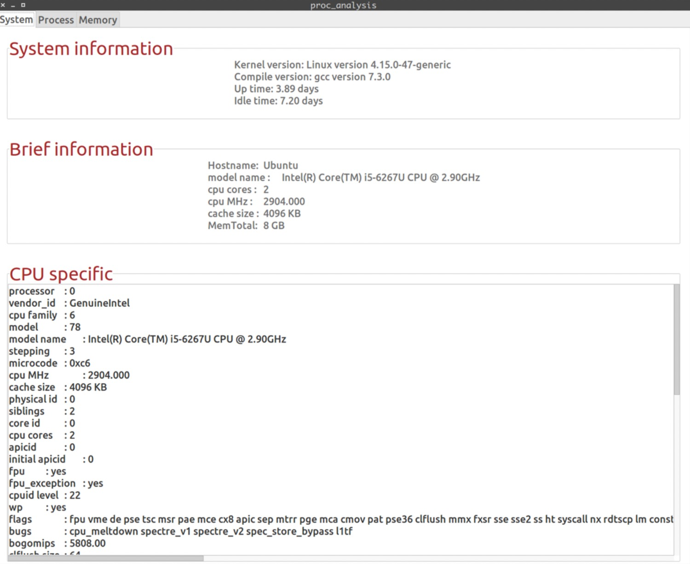

# 简单的Proc分析与图形化显示

## 开发环境

| **操作系统**     | **Ubuntu Linux   18.04 LTS (Linux version 4.15.0-43-generic)** |
| ---------------- | :----------------------------------------------------------- |
| **编译器**       | gcc (Ubuntu   7.3.0-27ubuntu1~18.04) 7.3.0                   |
| **集成开发环境** | CLion 2018.3.2                                               |
| **CMake版本**    | 3.13.2(3.5以上即可)                                          |

## 模块显示

<center>本系统显示信息划分</center>

| **子模块**   | **所属模块** | **主要显示内容** | **动态刷新** |
| ------------ | ------------ | ---------------- | ------------ |
| 系统概要     | 系统模块     | 版本与时间       | 是           |
| 系统总体信息 | 系统模块     | 主机、CPU等信息  | 否           |
| CPU具体信息  | 系统模块     | CPU详细参数      | 否           |
| 进程总体     | 进程模块     | CPU或内存利用率  | 是           |
| 进程具体     | 进程模块     | 所有进程摘要信息 | 是           |
| 内存具体信息 | 内存模块     | 内存详细参数     | 是           |

<center>proc文件分析内容与文件路径表格</center>

| **路径名**                | **文件内容**     | **所属子模块** | **所属模块** |
| ------------------------- | ---------------- | -------------- | ------------ |
| /proc/version             | 内核和编译器版本 | 系统概要       | 系统模块     |
| /proc/uptime              | 系统开启时间等   | 系统概要       | 系统模块     |
| /proc/cpuinfo             | CPU具体          | CPU具体信息    | 系统模块     |
| /proc/sys/kernel/hostname | 主机名           | 系统总体       | 系统模块     |
| /proc/cpuinfo             | CPU具体          | CPU占用率      | 进程模块     |
| /proc/meminfo             | 内存具体         | 内存占用率     | 进程模块     |
| /proc/stat                | 进程总体信息     | 进程总体       | 进程模块     |
| /proc/pid/stat            | 进程具体信息     | 进程具体       | 进程模块     |
| /proc/meminfo             | 内存具体信息     | 内存具体       | 内存模块     |

## 运行效果截图

System模块的界面如下：



<center>System模块界面</center>

​       如上图所示，System模块由三栏内容组成，参考前文的子模块划分，第一栏是系统的基本信息，这个信息时动态刷新的，第二个和第三个模块分别是简介信息和CPU详细信息，这两个模块是静态的，符合设计要求。

​       下面测试Process模块，如下图4.7所示：


<center>Process模块界面</center>

​    对于Process界面，可以看到CPU和内存的变化曲线图。在第二个子模块进程的详细信息模块，可以看到一些进程的信息(由于读取进程时是按照进程号从小到大读的，所以进程是按照进程号从小到大排序的)。

​	下面是一些根据关键词排序的测试。


<center>进程根据CPU占用率排序测试</center>


<center>进程根据VSZ排序测试</center>

## 部分值计算原理

对于每个进程的利用率，用以下方法进行计算：

**部分内容参考了https://blog.csdn.net/tuzhutuzhu/article/details/18844321，侵权必删**

1. 计算指定进程的`cpu`使用率

①.计算系统的运行时间

```bash
cat /proc/uptime
```

得到系统运行的总时间`up_time`

②. 计算`process`的运行时间

``` bash
cat /proc/[pid]/stat
```

得到进程运行的总时间`total_time`和进程的启动时间`start_time`。

其中，`total_time` = `stime` + `utime`

③.获取系统时钟频率

``` C
unsigned long hz = sysconf(_SC_CLK_TCK);
```

④.计算`cpu`使用率

<center>seconds = up - (start_time / hz)</center>

从进程启动到当前的时间，单位为秒

<center>cpu_usage = (total_time * 1000UL) / hz / seconds</center>

2. 计算指定进程的内存使用率

①. 获取系统的`memsize`

``` bash
cat /proc/meminfo
```

②.获取进程的`page`数

``` bash
cat /proc/[pid]/stat
```

③.获取系统的`page size`(单位是`Byte`)

``` C
unsigned long page_size = sysconf(_SC_PAGE_SIZE);
```

④.计算内存使用率

<center>rss = page_cnt = page_size / 1024</center>

<center>mem_usage = (rss * 1000UL) / memsize</center>

对于动态监测总体的`CPU`利用率和内存利用率，需要首先确定利用率的计算方法。

对于内存的占用率的统计方法，只需要动态地读取同一时刻的`/proc/info`中的`MemTotal`和`MemFree`，即总内存和空闲内存，得到内存利用率公式如下：

<center>Mem% = (MemTotal – MemFree) / MemTotal</center>

3. 利用/proc/stat计算总CPU利用率

   分两次读入/proc/stat中的CPU空闲时间和总时间

<center>cpu usage = (idle2 - idle1) / (total_2 - total_1) * 100</center>

4. 利用/proc/meminfo计算总内存利用率

<center>mem usage = (MemTotal - MemFree) / MemTotal</center>

